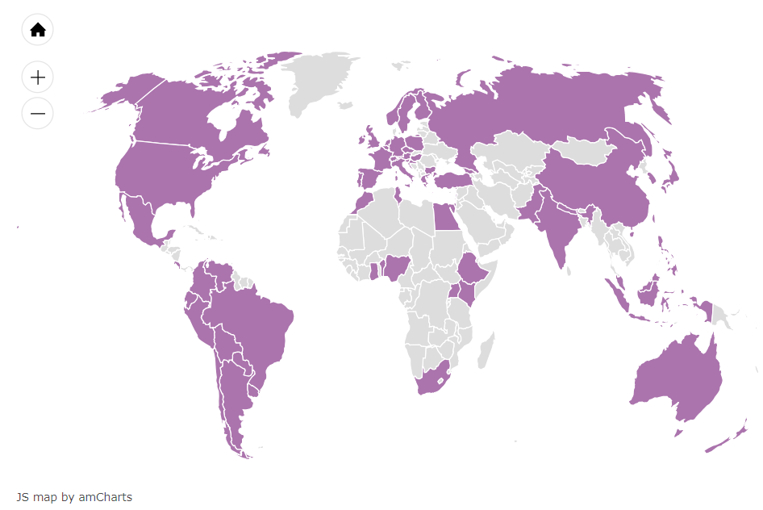

background-image: R-LadiesGlobal_RBG_online_LogoWithText_Horizontal.png

```{r setup, include=FALSE}
options(htmltools.dir.version = FALSE)
```

class: center, middle

# Kenalan dulu

Nama saya Sabhrina Gita Aninta (tapi biasa dipanggil Iga)

--

Saya salah satu pendiri [Tambora Muda Indonesia](https://tamboramuda.org)

--

Analis data paruh waktu (*Freelance Data Analyst*)

--

Admin Twitter @r_indonesia_

---
class: center, middle

# R-Ladies Global

## Mission

### "promote Gender Diversity in the R community"

---
class: center, middle

# R-Ladies Global

## Misi

### "komunitas R yang inklusif terhadap gender minoritas"

---
# Mengapa?

Komunitas R (atau pengguna bahasa pemrograman secara umum) masih didominasi laki-laki.

--

Pada tahun 2016, hanya ~11% pengembang *package* R adalah perempuan<sup>1</sup>.

--

R-Ladies bertujuan untuk mendukung, menginspirasi, membimbing, dan mewadahi **orang-orang yang semangat belajar R**<sup>2</sup> untuk mengembangkan potensi mereka dalam menggunakan R, dengan membangun jaringan global pengguna, pengembang, pembelajar, dan mentor dalam R untuk memfasilitasi progres individu dan kolektif di seluruh dunia.

.footnote[

[1] http://forwards.github.io/data/

[2] khususnya **perempuan dan gender minoritas**

]

---
class: center, middle

# Kopdar R-Ladies pertama saya


---

class: center

# Struktur Organisasi R-Ladies


---

# Aturan Main

- Gratis

--

- Spesifik tentang R

--

- Partisipasi dalam komunitas mengutamakan perempuan/gender minoritas

--

- Gender mayoritas adalah tamu

--

- Seluruh anggota harus menaati [Kode Etik](https://github.com/rladies/starter-kit/blob/master/RLadiesRulesAndGuideLinesENES.md#CoCEN)

--

- Administrasi berbasis komunitas, independen terhadap pengaruh eksternal

---

# Kode Etik

R-Ladies berdedikasi untuk menyediakan wadah yang nyaman, bebas pelecehan untuk **segala kalangan**.

Kode Etik ini berlaku untuk segala bentuk ruang R-Ladies, termasuk kopdar, Twitter, Slack, *mailing lists*, baik daring maupun luring. Siapapun yang melanggar Kode Etik akan mendapatkan sanksi atau bahkan dikeluarkan dari ruang R-Ladies dengan sepengetahuan Para Pendiri.

Beberapa ruang R-Ladies mungkin memiliki aturan tambahan; peserta diharap bertanggung jawab untuk mengetahui dan menerapkan aturan ini.

---

# Apa saja yang termasuk pelecehan (*harassment*)?

- Komentar ofensif terkait gender, ekspresi dan identitas gender, orientasi seksual, disabilitas, penyakit mental, keunikan neural, penampilan fisik, ukuran tubuh, ras, usia, atau agama.

--

- Komentar tak diundang terkait gaya dan cara hidup seseorang, termasuk makanan, kesehatan, *parenting*, obat-obatan, dan pekerjaan.

--

- Dengan sengaja melabeli gender seseorang tidak sebagaimana mestinya.

--

- Menyebarkan gambar atau melakukan perilaku seksual dan keluar-topik di ruang yang tidak tepat.

--

- Kontak fisik atau simulasi kontak fisik (contoh: deskripsi tekstual semisal 'peluk', 'cium') tanpa izin atau setelah permintaan berhenti.

---

# Apa saja yang termasuk pelecehan (*harassment*)?

- Ancaman kekerasan.

--

- Menghasut individu untuk melakukan kekerasan, termasuk menyuruh seseorang untuk bunuh diri atau melukai diri sendiri.

--

- Intimidasi dengan sengaja.

--

- Menguntit secara berlebihan.

--

- Fotografi atau rekaman yang mengandung pelecehan, termasuk aktivitas daring untuk keperluan pelecehan.

--

- Interupsi diskusi secara berkelanjutan.

---

# Apa saja yang termasuk pelecehan (*harassment*)?

- Perhatian seksual yang tidak diundang.

--

- Pola kontak sosial yang tidak pantas, semisal permintaan/asumsi tingkat keintiman dengan individu lain.

--

- Komunikasi satu-lawan-satu yang berkelanjutan setelah permintaan untuk berhenti.

--

- Sengaja menonjolkan aspek apa pun dari identitas seseorang tanpa izin kecuali yang diperlukan untuk melindungi seseorang dari cacian/celaan/serangan.

--

- Publikasi komunikasi pribadi meskipun tidak tentang pelecehan.

---

class: center, bottom



# R-Ladies ada di mana saja?

---

# Ingin bergabung dalam misi R-Ladies?

- Dukung cabang [R-Ladies di sekitarmu](https://meetup.com/pro/rladies) dengan menyumbang lokasi *meetup* serta makanan dan minuman

--

- Dukung R-Ladies yang kalian kenal dengan mengundang mereka sebagai pemateri (gunakan [direktori R-Ladies ](https://rladies.org/directory/)!)

--

- [Bergabung](https://rladies.org/r-ladies-directory-form/) dalam [direktori R-Ladies](https://rladies.org/directory/)

--

- Dukung gender minoritas untuk menjadi bagian dari R-Ladies

--

- Bagi-bagi kode (bisa di GitHub [R-Ladies Bogor](https://github.com/bogoRladies), [R-Indonesia](https://github.com/indo-r) atau [R-Ladies Global](https://github.com/rladies))

--

- Saling mendukung dan menginspirasi (mengajar R, menulis tutorial, dsb)

--

- Ikuti Slack komunitas R-Ladies di [sini](https://rladies-community-slack.herokuapp.com)

--

- Tweet, retweet, dan follow @RLadiesGlobal dan akun Twitter R-Ladies lainnya

--

- Ingin buka chapter? Konsultasikan dengan kami atau info@rladies.org

---

class: center, middle

# Terima kasih!

### Ada pertanyaan?<sup>*</sup>

Hubungi kami lebih lanjut di bogor@rladies.org

.footnote[
[\*] Presentasi ini dibuat dengan R package [**xaringan**](https://github.com/yihui/xaringan).
]