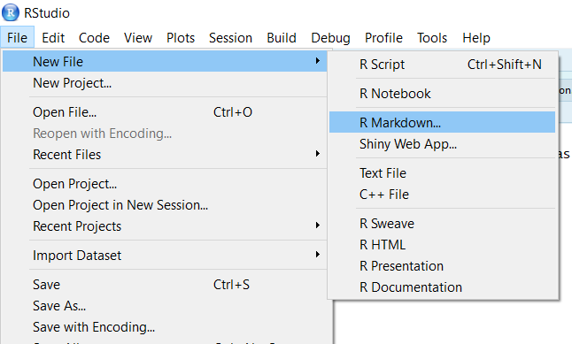

# Apa itu Rmarkdown?

Rmarkdown adalah sebuah ekstensi Markdown untuk R.

Sekalinya bisa Rmarkdown, kamu bisa bikin ini semua di R:
- Laporan docx

--

- Laporan pdf<sup>*</sup>

--

- Website statis

--

- Presentasi

--

- Buku

--

- [dan masih banyak lagi!](https://rmarkdown.rstudio.com/gallery.html)

.footnote[
[*] Ini butuh TeX dan agak bikin frustasi kalo pake Windows
]

---
# Gimana caranya?

File R markdown minimal yang dapat dieksekusi telah disediakan Rstudio.



---

# Gimana caranya?

Dengan pengenalan dan *cheatsheet* yang juga telah disediakan Rstudio, kita bisa mengatur Rmarkdown sesuai keperluan kita.


---

# Anatomi Rmarkdown

Satu file Rmarkdown (.Rmd) terdiri dari dua bagian: metadata (YAML) dan badan dokumen (R dan markdown)

```yaml
---
title: "Laporan Data "
author: "Sabhrina G. Aninta"
date: "26 April 2017"
mainfont: Calibri Light
output:
  html_document: default
---

# Edgar Anderson's Iris Data

#### Description
This famous (Fisher's or Anderson's) iris data set gives the measurements in centimeters of the variables sepal length and width and petal length and width, respectively, for 50 flowers from each of 3 species of iris. The species are *Iris setosa*, *versicolor*, and *virginica*.
```

---

# Memasukan kode R dalam laporan

Kode dapat dimasukkan ke dalam laporan dengan mengawali dan mengakhiri kode menggunakan tanda '`' sebanyak tiga kali.

Bagaimana kode ingin ditampilkan dapat diatur di dalam `{}`, setelah `r`.

````markdown
`r ''````{r contoh,  echo=FALSE, message=FALSE, fig.height=4}
library(ggplot2)
ggplot(mtcars) + 
  aes(mpg, disp) + 
  geom_point() +   
  geom_smooth()    
```
````
````

---

# Memasukan kode R dalam laporan

```{r contohPlot, echo=FALSE, message=FALSE, fig.height=4}
library(ggplot2)
ggplot(mtcars) + 
  aes(mpg, disp) + 
  geom_point() +   
  geom_smooth()    
```


---


# Menulis persamaan

Kita dapat menulis silmbol matematis dalam tanda `$`, contoh: &#36;\alpha+\beta &#36; menghasilkan $\alpha+\beta$. 

Untuk menampilkan persamaan dalam baris tersendiri di luar kalimat, dapat menggunakan tanda dolar ganda:

```
$$\bar{X}=\frac{1}{n}\sum_{i=1}^nX_i$$
```

$$\bar{X}=\frac{1}{n}\sum_{i=1}^nX_i$$

Kendala:

1. Kode harus ada dalam satu baris, kecuali menggunakan tanda dolar ganda (`$$`);

1. Tidak boleh ada spasi setelah `$` pembuka atau sebelum `$` penutup.

---

# Alternatif pengaturan kode

`message = FALSE` untuk menekan pesan dari R ketika dokumen dicompile

`include = TRUE` untuk tidak menampilkan kode, namun hasilnya

`echo = TRUE` untuk hanya menampilkan hasil kode, tanpa kodenya

`eval = FALSE` agar kode tidak dieksekusi 


Kalau lupa, coba-coba saja semua alternatif dalam cheatsheet!

---

# Sumber belajar Rmarkdown

Lebih enak mulai dari pengenalan Rmarkdown yang dibuat Rstudio di sini: https://rmarkdown.rstudio.com/articles_intro.html

Lalu bolak-balik buka

1. cheatsheet dari [Rstudio](https://www.rstudio.com/resources/cheatsheets/)

2. [buku panduan Rmarkdown](https://bookdown.org/yihui/rmarkdown/)


---

class: center, middle

# Langsung praktik kuy!
